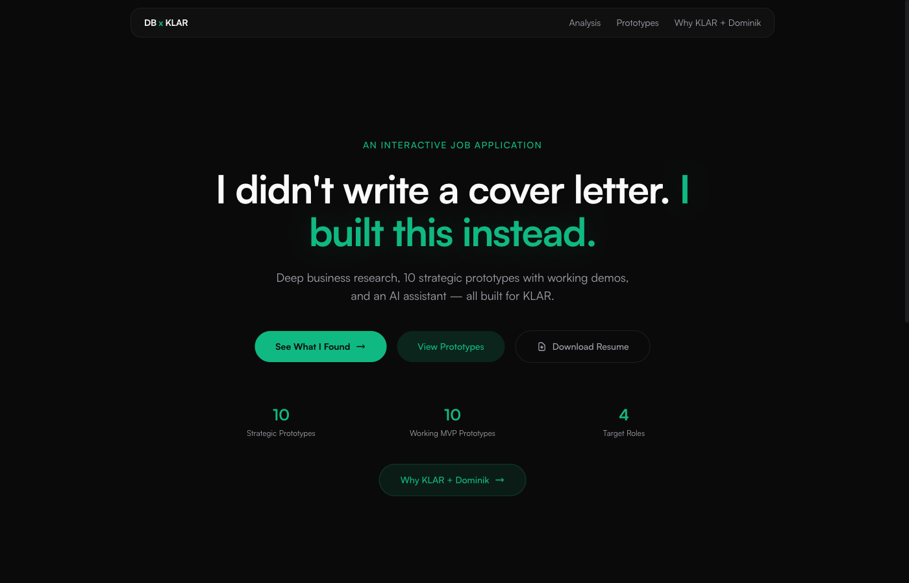
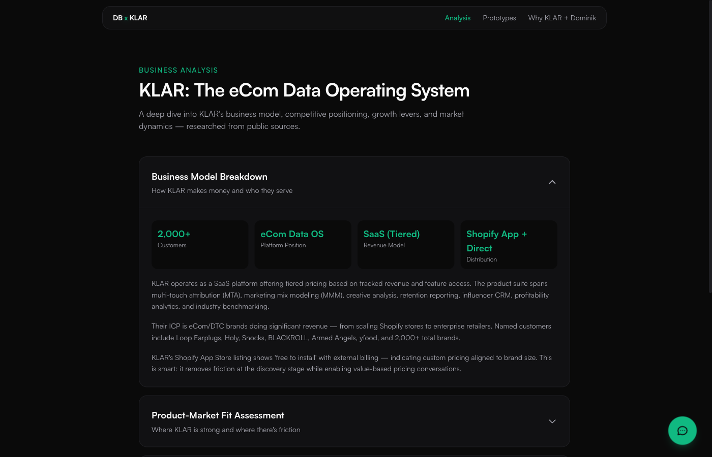
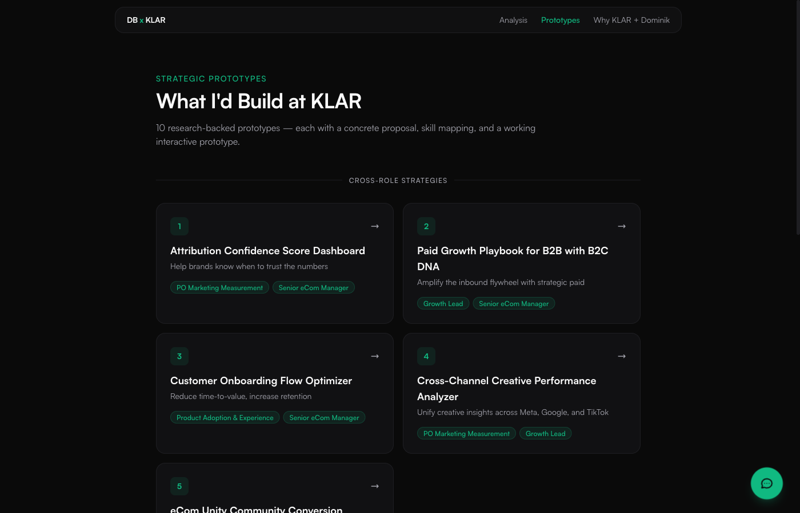
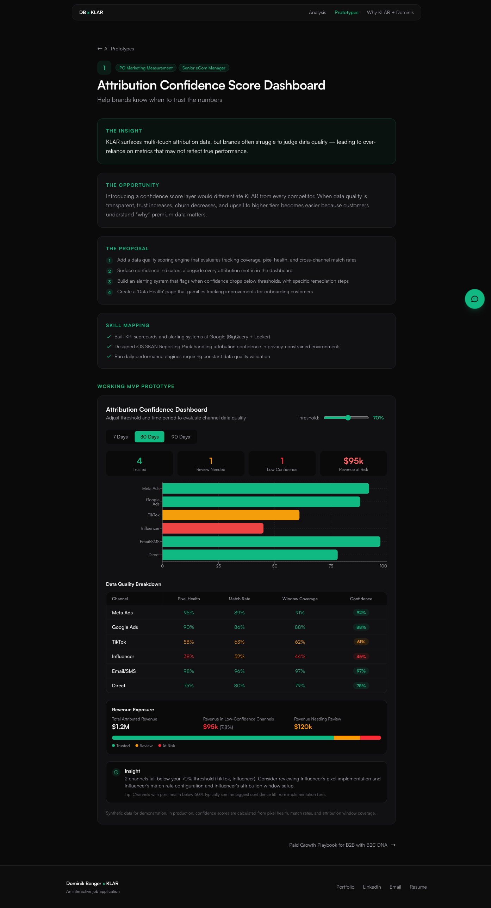
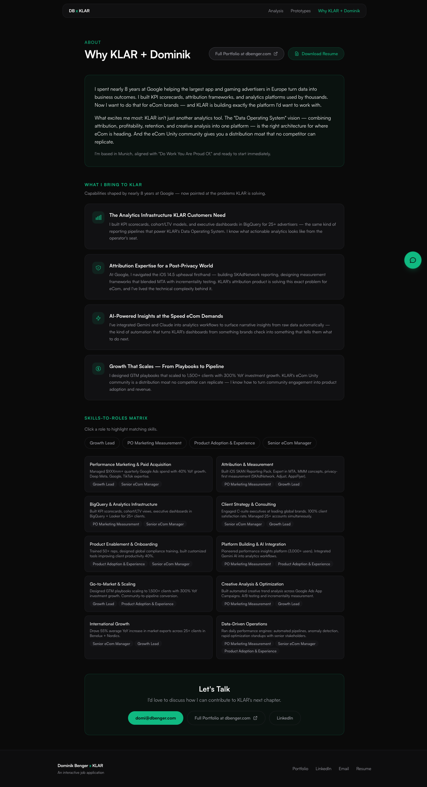
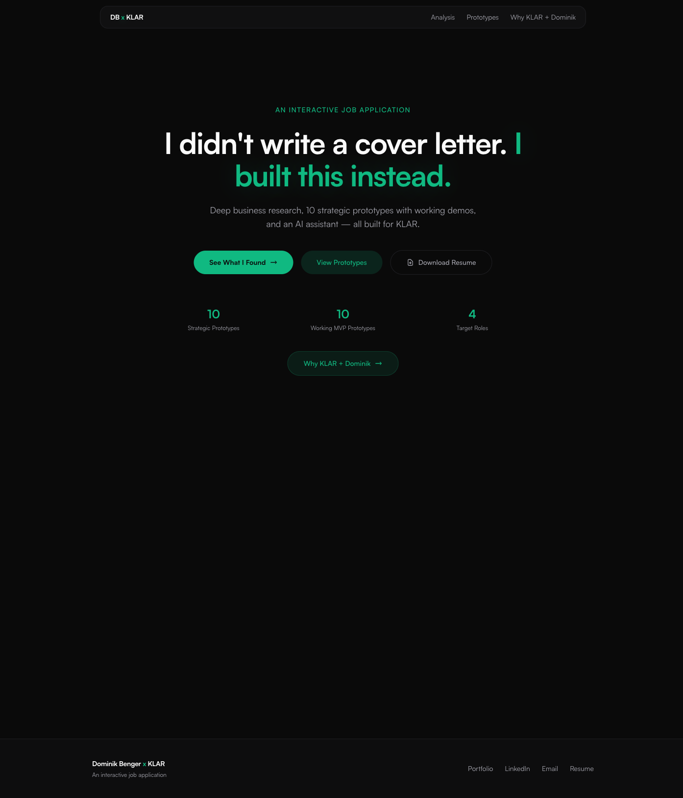

<div align="center">

# I didn't write a cover letter. I built this instead.

**An interactive job application built as a full-stack Next.js web app**

[](https://klar.dbenger.com)
[](https://nextjs.org/)
[](https://www.typescriptlang.org/)
[](https://tailwindcss.com/)

<br />



</div>

---

## What is this?

Instead of sending a traditional cover letter, I built a **full interactive web application** targeting a specific company — [KLAR](https://getklar.com), the eCom Data Operating System. The app demonstrates deep business research, strategic thinking, and technical capability through:

- **Deep business analysis** of the company's business model, competitive landscape, and growth levers
- **10 strategic prototype ideas** — each with a written proposal and a **working interactive demo**
- **An AI chatbot** (Gemini Flash) that can answer questions about me, the company, and this application
- **A skills-to-roles matrix** mapping my experience to 4 open positions

The goal: make the hiring team think *"I need to talk to this person."*

---

## Live Demo

**[klar.dbenger.com](https://klar.dbenger.com)** — deployed on Vercel with a custom domain.

---

## Screenshots

<table>
<tr>
<td width="50%">

### Landing Page


</td>
<td width="50%">

### Business Analysis


</td>
</tr>
<tr>
<td width="50%">

### Prototype Overview


</td>
<td width="50%">

### Interactive MVP Demo


</td>
</tr>
</table>

<details>
<summary><strong>More screenshots</strong></summary>
<br />

### About / Skills Matrix


### Full Homepage with Embedded AI Chat


</details>

---

## How it was built

This entire project — from research to deployment — was built in **3 days** using [Claude Code](https://docs.anthropic.com/en/docs/claude-code) as a coding partner. Here's the step-by-step process:

### Step 1: Research & Planning

Before writing any code, I conducted deep research on the target company:

- Analyzed the company website, blog, pricing, and product pages
- Researched the founding team on LinkedIn
- Mapped the competitive landscape (6 competitors)
- Read all 4 open job descriptions in detail
- Studied the company's community (eCom Unity — 2,000+ members)

This research became the foundation for all content in the app.

### Step 2: Project Scaffolding

```
npx create-next-app@latest --typescript --tailwind --app --src-dir
```

Key setup decisions:
- **Next.js 16 App Router** — file-based routing, React Server Components for static content
- **Tailwind CSS v4** — utility-first styling with `@theme inline {}` configuration
- **Self-hosted Satoshi font** — via `next/font/local` to avoid Google Fonts dependency
- **Dark mode as default** — not a toggle, set at the CSS level

### Step 3: Content Architecture

All content lives in **typed TypeScript data files**, not scattered across components:

```
src/data/
├── analysis.ts       # Business analysis (5 sections, structured data)
├── prototypes.ts     # 10 prototype entries with metadata, tags, descriptions
└── skills-roles.ts   # Skills-to-roles mapping for the About page
```

This separation makes it easy to update content without touching component code.

### Step 4: Page-by-Page Build

Each page serves a specific purpose in the narrative:

| Page | Purpose | Key Features |
|------|---------|-------------|
| `/` | Hook — grab attention | Hero headline, stats, embedded AI chat |
| `/analysis` | Credibility — show research depth | 5 expandable sections, competitive comparison |
| `/prototypes` | Breadth — show strategic range | Card grid, role tags, 2 categories |
| `/prototypes/[1-10]` | Depth — prove technical skill | Written proposal + working interactive demo |
| `/about` | Fit — connect skills to roles | Capability cards, skills matrix, CTA |

### Step 5: Interactive MVP Prototypes

Each of the 10 prototypes includes a **fully interactive demo** built with Recharts:

- **Synthetic data** — no external API dependencies, all data is hardcoded
- **User controls** — sliders, dropdowns, toggles, tabs, date ranges
- **Reactive charts** — visualizations update in real-time based on user input
- **Data tables** — detailed breakdowns alongside the charts
- **Contextual insights** — dynamic text that changes based on the current state

Example controls per prototype:

| # | Prototype | Controls |
|---|-----------|----------|
| 1 | Attribution Confidence Dashboard | Confidence threshold slider, time period tabs |
| 2 | Paid Growth Playbook | Budget slider, channel mix, scenario comparison |
| 3 | Onboarding Flow Optimizer | Stage selector, time remaining, health gauge |
| 4 | Creative Performance Analyzer | Platform filter, creative type, date range |
| 5 | Community Conversion Pipeline | Stage filter, member detail panel, trends |
| 6 | Attribution Model Comparator | Model selector, %/absolute toggle, variance |
| 7 | Channel Saturation Analyzer | Budget sliders per channel, overlay toggle |
| 8 | Incrementality Test Planner | Channel, MDE slider, confidence, duration |
| 9 | Privacy Signal Loss Simulator | 3 signal loss sliders, KLAR toggle, timeline |
| 10 | Unified Measurement Framework | Method weights, convergence scoring |

### Step 6: AI Chat Integration

The app includes an AI chatbot powered by **Google Gemini Flash**, accessible two ways:

1. **Embedded chat** on the homepage — inline, always visible
2. **Floating chat widget** on all other pages — FAB trigger, side panel

Architecture:

```
Client (React)  →  POST /api/ai/chat  →  Gemini Flash API
                   (Next.js API Route)    (server-side proxy)
```

The API key stays server-side. The knowledge base (`klar-knowledge.ts`) includes:
- Full resume context
- Company research findings
- All 10 prototype summaries
- Job description details
- Conversation strategy instructions

### Step 7: Polish & Deploy

- **OG image** — edge-generated 1200x630 social preview
- **Custom 404 page** — branded, with navigation back
- **Responsive design** — mobile-first, tested on iPhone Safari
- **Accessibility** — `prefers-reduced-motion`, focus styles, semantic HTML, ARIA attributes
- **Vercel deployment** — auto-deploy from GitHub, custom domain

---

## Architecture

```
┌─────────────────────────────────────────────────────────┐
│                        Vercel                           │
│                                                         │
│  ┌──────────────────────────────────────────────────┐   │
│  │              Next.js 16 App Router               │   │
│  │                                                  │   │
│  │  Static Pages (SSG)          API Route           │   │
│  │  ┌─────────────────┐   ┌──────────────────┐     │   │
│  │  │ /               │   │ POST /api/ai/chat│     │   │
│  │  │ /analysis       │   │                  │     │   │
│  │  │ /prototypes     │   │ ┌──────────────┐ │     │   │
│  │  │ /prototypes/[id]│   │ │ klar-        │ │     │   │
│  │  │ /about          │   │ │ knowledge.ts │ │     │   │
│  │  │ /not-found      │   │ └──────┬───────┘ │     │   │
│  │  └─────────────────┘   │        │         │     │   │
│  │                        │        ▼         │     │   │
│  │  Client Components     │  Gemini Flash    │     │   │
│  │  ┌─────────────────┐   │  API (Google)    │     │   │
│  │  │ Rec1-10 MVPs    │   └──────────────────┘     │   │
│  │  │ ChatWidget      │                            │   │
│  │  │ EmbeddedChat    │   Data Layer               │   │
│  │  │ FloatingNav     │   ┌──────────────────┐     │   │
│  │  └─────────────────┘   │ prototypes.ts    │     │   │
│  │                        │ analysis.ts      │     │   │
│  │                        │ skills-roles.ts  │     │   │
│  │                        └──────────────────┘     │   │
│  └──────────────────────────────────────────────────┘   │
└─────────────────────────────────────────────────────────┘
```

### Key Architectural Decisions

| Decision | Reasoning |
|----------|-----------|
| **App Router (not Pages)** | File-based routing, React Server Components for static content, cleaner layouts |
| **Static rendering + 1 dynamic route** | All pages are SSG except `/api/ai/chat` (force-dynamic). Fast loads, low cost |
| **Server-side AI proxy** | API key never exposed to client. Single knowledge base shared across requests |
| **Typed data files** | Content in `src/data/*.ts` with TypeScript interfaces. Single source of truth |
| **Chat state in React context** | History preserved across navigation. Acceptable to lose on full refresh |
| **Recharts for MVPs** | Pre-built React chart components. Fast to build 10 interactive dashboards |
| **Self-hosted fonts** | No Google Fonts dependency. Faster loading, better privacy |

---

## Tech Stack

| Category | Technology |
|----------|-----------|
| **Framework** | [Next.js 16](https://nextjs.org/) (App Router, TypeScript) |
| **Styling** | [Tailwind CSS v4](https://tailwindcss.com/) |
| **Charts** | [Recharts 3](https://recharts.org/) |
| **Animations** | [Framer Motion 12](https://www.framer.com/motion/) |
| **AI Backend** | [Google Gemini Flash](https://ai.google.dev/) (via REST API) |
| **Fonts** | [Satoshi](https://www.fontshare.com/fonts/satoshi) (self-hosted) |
| **Analytics** | [@vercel/analytics](https://vercel.com/analytics) |
| **Deployment** | [Vercel](https://vercel.com/) |

---

## Project Structure

```
src/
├── app/
│   ├── layout.tsx              # Root layout (nav, footer, chat provider, fonts)
│   ├── page.tsx                # Landing / Hero + embedded AI chat
│   ├── globals.css             # Dark mode, accessibility, fonts
│   ├── analysis/page.tsx       # Business analysis (5 expandable sections)
│   ├── prototypes/
│   │   ├── page.tsx            # Card grid (10 prototypes, 2 categories)
│   │   └── [id]/page.tsx       # Individual prototype + interactive MVP
│   ├── about/page.tsx          # Capabilities, skills matrix, CTA
│   ├── not-found.tsx           # Custom 404
│   └── api/ai/
│       ├── klar-knowledge.ts   # Shared knowledge base (resume + research)
│       └── chat/route.ts       # Gemini Flash proxy (force-dynamic)
├── components/
│   ├── layout/                 # FloatingNav, Footer, ChatWidget, ChatProvider
│   ├── prototypes/             # PrototypeContent, Rec1MVP–Rec10MVP
│   └── ui/                     # Card, Badge, ExpandableSection
├── data/
│   ├── prototypes.ts           # 10 prototype entries with metadata
│   ├── analysis.ts             # Business analysis structured data
│   └── skills-roles.ts         # Skills-to-roles mapping
└── lib/
    └── utils.ts                # Type helpers
```

---

## Run Locally

### Prerequisites

- Node.js 18+
- A [Google Gemini API key](https://aistudio.google.com/apikey) (free tier works)

### Setup

```bash
# Clone the repo
git clone https://github.com/Ninety2UA/job-application-example.git
cd job-application-example

# Install dependencies
npm install

# Create environment file
echo "GEMINI_API_KEY=your_api_key_here" > .env.local

# Start dev server
npm run dev
```

Open [http://localhost:3000](http://localhost:3000).

### Build for production

```bash
npm run build   # Verify 0 errors
npm start       # Serve production build locally
```

---

## Adapting This for Your Own Job Application

This project can serve as a template. Here's how to adapt it:

### 1. Research Phase (most important)
- Study the target company deeply: product, pricing, competitors, team, culture
- Read every open job description
- Identify 5-10 specific problems you could solve for them

### 2. Content Swap
- Replace `src/data/prototypes.ts` with your own prototype ideas
- Replace `src/data/analysis.ts` with your research findings
- Update `src/data/skills-roles.ts` with your skills and their open roles
- Update `src/app/api/ai/klar-knowledge.ts` with your resume and context

### 3. Design Customization
- Update colors in `src/app/globals.css` (match the company's brand)
- Swap the font in `src/app/layout.tsx`
- Update OG image in `src/app/opengraph-image.tsx`

### 4. MVP Prototypes
- Each prototype is a standalone React component in `src/components/prototypes/`
- Use Recharts for data visualizations
- Keep data synthetic — no external dependencies
- Include at least one user-manipulable control per prototype

### 5. Deploy
- Push to GitHub
- Import in [Vercel](https://vercel.com/) (free tier)
- Add `GEMINI_API_KEY` to environment variables
- Configure custom domain (optional)

---

## What Claude Code Did

This project was built collaboratively with [Claude Code](https://docs.anthropic.com/en/docs/claude-code). Here's how the work was split:

| Phase | My Role | Claude Code's Role |
|-------|---------|-------------------|
| **Research** | Decided what to research, evaluated findings | Fetched and synthesized public data |
| **Architecture** | Chose tech stack, made design decisions | Scaffolded project, configured tools |
| **Content** | Wrote strategic narratives, prototype ideas | Structured into typed data files |
| **UI/UX** | Directed design aesthetic, reviewed every page | Built all components, responsive layouts |
| **MVPs** | Defined what each prototype should demonstrate | Built 10 interactive dashboards with Recharts |
| **AI Chat** | Wrote the knowledge base and conversation strategy | Built API route, chat UI, context management |
| **Polish** | QA'd on mobile, directed fixes | OG image, 404, accessibility, performance |

Total: **~8,000 lines of TypeScript/CSS** across **38 files**, built over **8 sessions**.

---

## Stats

| Metric | Value |
|--------|-------|
| Pages | 13 (landing, analysis, 10 prototypes, about, 404) |
| Interactive MVPs | 10 (with charts, tables, sliders, toggles) |
| Lines of code | ~8,000 (TypeScript + CSS) |
| Components | 38 files |
| Target roles | 4 |
| Build time | 3 days |
| Lighthouse mobile | 90+ |

---

## License

This project is open source under the [MIT License](LICENSE). Feel free to use it as inspiration for your own creative job applications.

---

<div align="center">

**Built by [Dominik Benger](https://dbenger.com)** | **[LinkedIn](https://www.linkedin.com/in/dombenger/)** | **[Email](mailto:domi@dbenger.com)**

*Sometimes the best cover letter is the one you don't write.*

</div>
